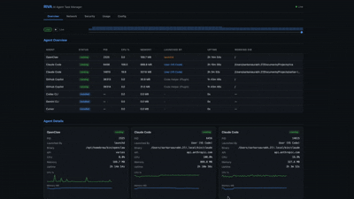
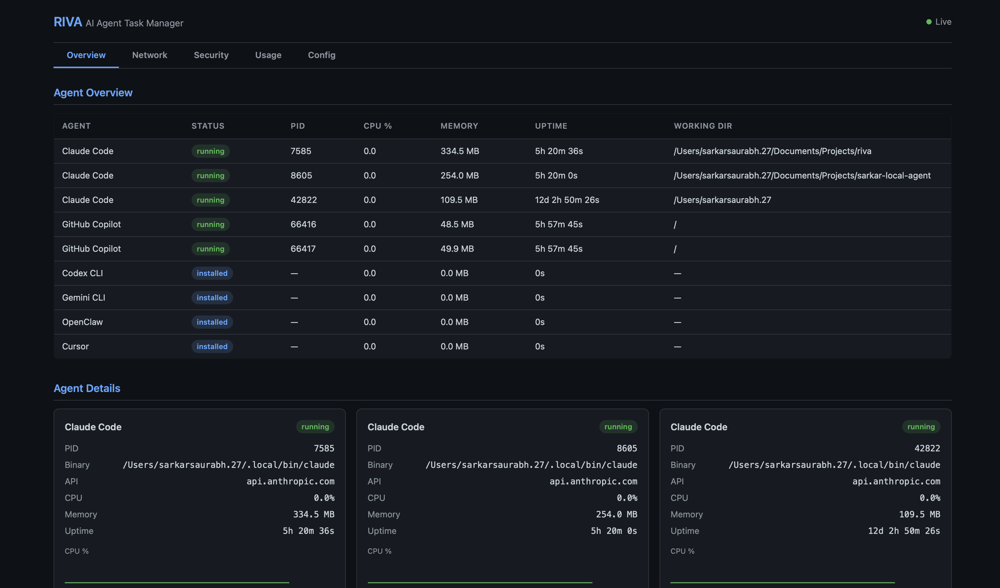
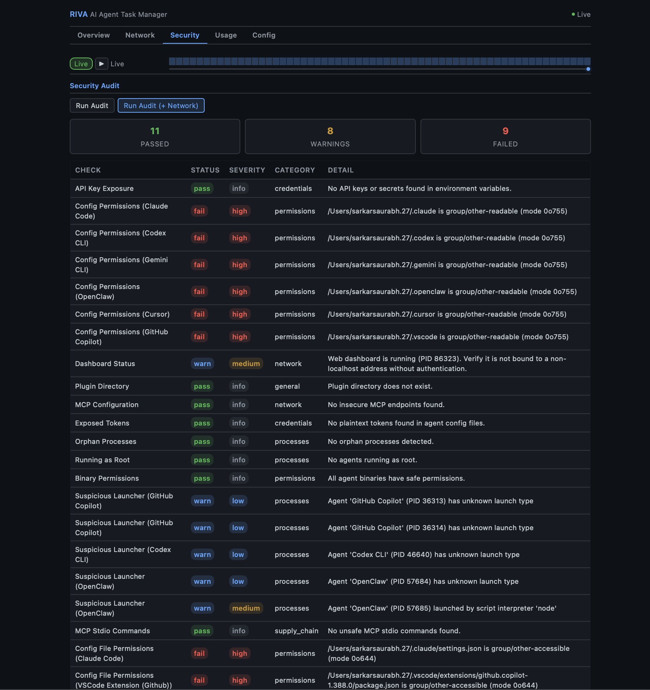

# 🧐 rivA

Observe, monitor, and control local AI agents running on your machine.

<p align="center">
  <a href="LICENSE"></a>
  <a href="https://pypi.org/project/riva/"></a>
  <a href="#requirements"></a>
  <a href="#requirements"></a>
  <a href="https://discord.com/channels/1467923903597908244/1467926078356984110"></a>
</p>

Riva is a **local-first observability and control plane for AI agents**.
It helps you understand what agents are running on your machine, what they are doing, and how they are behaving in real time.

As agent frameworks push toward autonomy, visibility often disappears.
Riva exists to restore **clarity, safety, and trust**.

[Getting Started](#quick-start) · [How it works](#how-it-works) · [CLI Reference](#cli-reference) · [Web Dashboard](#web-dashboard) · [Security](#security) · [Contributing](#contributing) · [Discord](https://discord.com/channels/1467923903597908244/1467926078356984110)

---

## Demo

<p align="center">
  
</p>

| Agent Overview | Infosec Monitoring |
|:---:|:---:|
|  |  |

---

## How it works

```
Local Agents (Claude Code / Codex CLI / Gemini CLI / LangGraph / CrewAI / AutoGen / ...)
                 |
                 v
        +------------------+
        |       Riva       |    discovery, metrics, logs, lifecycle
        |  (observability) |
        +--------+---------+
                 |
        +--------+---------+
        |        |         |
      CLI      TUI    Web Dashboard
                |
           System Tray (macOS)
```

Riva runs entirely on your machine.
It **observes agent behavior** but does not execute agent actions.

---

## Highlights

- **Agent discovery** — detect locally running agents across 13 frameworks and growing
- **Lifecycle visibility** — see when agents start, stop, crash, or hang
- **Resource tracking** — CPU, memory, and uptime per agent in real time
- **Token usage stats** — track token consumption, model usage, and tool call frequency
- **Environment scanning** — detect exposed API keys in environment variables
- **Sandbox detection** — detect whether agents run inside containers (Docker, Podman, containerd, LXC) or directly on the host
- **Session forensics** — `riva forensic` deep-dive analysis of agent session transcripts — timeline, patterns, decisions, efficiency metrics
- **OpenTelemetry export** — `riva otel` pushes metrics, logs, and traces to any OTel-compatible backend (Datadog, Grafana, Jaeger) via OTLP
- **Security audit** — `riva audit` checks for config permission issues, exposed secrets, and dashboard misconfiguration
- **System tray** — native macOS menu bar app for quick access to TUI, web dashboard, scan, and audit (compiled Swift)
- **Web dashboard** — Flask-based dashboard with REST API, security headers, optional auth token, and forensic drill-in
- **Framework-agnostic** — works across multiple agent frameworks and custom agents
- **Local-first** — no cloud, no telemetry, no hidden data flows

---

## Supported Frameworks

Riva ships with built-in detectors for these agent frameworks:

| Framework | Binary / Process | Config Dir | API Domain |
|-----------|-----------------|------------|------------|
| [Claude Code](https://docs.anthropic.com/en/docs/claude-code) | `claude` | `~/.claude` | api.anthropic.com |
| [Codex CLI](https://github.com/openai/codex) | `codex` | `~/.codex` | api.openai.com |
| [Gemini CLI](https://github.com/google-gemini/gemini-cli) | `gemini` | `~/.gemini` | generativelanguage.googleapis.com |
| [OpenClaw](https://github.com/openclaw) | `openclaw`, `clawdbot` | `~/.openclaw` | varies |
| [LangGraph](https://langchain-ai.github.io/langgraph/) | `langgraph` / Python | `~/.langgraph` | api.smith.langchain.com |
| [CrewAI](https://www.crewai.com/) | `crewai` / Python | `~/.crewai` | app.crewai.com |
| [AutoGen](https://microsoft.github.io/autogen/) | `autogen` / Python | `~/.autogen` | varies |
| [OpenCode](https://opencode.ai/) | `opencode` | `~/.config/opencode` | varies |

Python-based frameworks (LangGraph, CrewAI, AutoGen) are detected by matching `python` processes whose command line references the framework.

**Adding more frameworks** — Riva is extensible via:
1. Built-in detectors in `src/riva/agents/`
2. Third-party pip packages using `[project.entry-points."riva.agents"]`
3. Plugin scripts dropped into `~/.config/riva/plugins/`

---

## What Riva Is Not

Riva is intentionally not:
- An AI agent
- An orchestration framework
- A cloud monitoring service
- A replacement for agent runtimes

Riva does not make decisions.
It makes **agent behavior visible**.

---

## Requirements

- **macOS** (Ventura, Sonoma, Sequoia) or **Linux**
- Windows via **WSL2**
- Python 3.11+
- **System tray** (optional, macOS only): Xcode Command Line Tools (`xcode-select --install`)

---

## Quick Start

### Install from PyPI

```bash
pip install riva
```

### Install via bash script

```bash
curl -fsSL https://raw.githubusercontent.com/sarkar-ai-taken/riva/main/install.sh | bash
```

### Install with OpenTelemetry support

```bash
pip install riva[otel]
```

### Install from source

```bash
git clone https://github.com/sarkar-ai-taken/riva.git
cd riva
pip install -e ".[test]"
```

### Verify

```bash
riva --help
```

---

## CLI Reference

### `riva scan`

One-shot scan for running AI agents.

```bash
riva scan              # Rich table output
riva scan --json       # JSON output
riva scan --otel       # Scan and export metrics/logs to OTel collector
```

### `riva watch`

Launch the live TUI dashboard with real-time resource monitoring.

```bash
riva watch
```

### `riva tray`

Native macOS system tray (menu bar app). Provides quick access to both the TUI and web dashboards, plus scan and audit actions.

```bash
riva tray                      # Start daemon (background)
riva tray start                # Same as above
riva tray start -f             # Foreground mode
riva tray start --port 9090    # Custom web port
riva tray stop                 # Stop the tray daemon
riva tray status               # Show running state and PID
riva tray logs                 # View tray logs
riva tray logs -f              # Follow log output
```

Requires Xcode Command Line Tools (`xcode-select --install`). The Swift binary is compiled on first launch and cached at `~/.cache/riva/tray-mac`.

**Menu items:**

| Action | Description |
|--------|-------------|
| Open TUI Dashboard | Opens Terminal.app with `riva watch` |
| Open Web Dashboard | Opens browser to the web dashboard URL |
| Start Web Server | Starts the web daemon in the background |
| Stop Web Server | Stops the running web daemon |
| Quick Scan | Opens Terminal.app with `riva scan` |
| Security Audit | Opens Terminal.app with `riva audit` |
| Quit | Exits the tray |

### `riva stats`

Show token usage and tool execution statistics.

```bash
riva stats                        # All agents
riva stats --agent "Claude"       # Filter by name
riva stats --json                 # JSON output
```

### `riva list`

Show all known agent types and their install status.

```bash
riva list
```

### `riva config`

Show parsed configurations for detected agents.

```bash
riva config
```

### `riva audit`

Run a security audit and print a report.

```bash
riva audit             # Rich table with PASS/WARN/FAIL
riva audit --json      # JSON output
```

Checks performed:
- API key / secret exposure in environment variables
- Config directory and file permissions (group/other-accessible)
- Web dashboard bind address and status
- Plugin directory existence and permissions
- MCP server configs — HTTP endpoints, shell commands, temp-dir references
- Plaintext token scanning across all agent config files
- Agent processes running as root (UID 0)
- Agent binary writability (group/world-writable binaries)
- Suspicious launcher detection (unknown or script-interpreter parents)
- Orphan process detection
- Network checks (with `--network`): unencrypted connections, unknown destinations, excessive connections, stale sessions

See [Security Audit Details](#security-audit-details) for the full list and rationale.

### `riva forensic`

Session forensics — deep-dive analysis of AI agent session transcripts (JSONL).

```bash
riva forensic sessions                    # List recent sessions
riva forensic sessions --project riva     # Filter by project
riva forensic summary latest              # Summary of latest session
riva forensic timeline <slug>             # Event-by-event timeline
riva forensic patterns <slug>             # Detected anti-patterns
riva forensic decisions <slug>            # Key decision points
riva forensic files <slug>                # File access report
riva forensic trends                      # Cross-session aggregate metrics
riva forensic trends --limit 50 --json    # JSON output
```

Session identifiers: `latest`, a session slug (e.g. `witty-shimmying-haven`), a UUID prefix, or a full UUID.

### `riva otel`

OpenTelemetry export — push metrics, logs, and traces to any OTel-compatible backend.

Requires the optional `otel` extra: `pip install riva[otel]`

```bash
riva otel status                            # Show SDK availability and config
riva otel status --json                     # JSON output
riva otel export-sessions                   # Export forensic sessions as traces
riva otel export-sessions --limit 5         # Limit session count
riva otel export-sessions --project myapp   # Filter by project
```

Configuration via `.riva/config.toml`:

```toml
[otel]
enabled = true
endpoint = "http://localhost:4318"
protocol = "http"
service_name = "riva"
export_interval = 5.0
metrics = true
logs = true
traces = false

[otel.headers]
Authorization = "Bearer <token>"
```

Or via environment variables: `OTEL_EXPORTER_OTLP_ENDPOINT`, `OTEL_SERVICE_NAME`, `RIVA_OTEL_ENABLED`.

---

## Web Dashboard

### Start / Stop

```bash
riva web start                  # Background daemon
riva web start -f               # Foreground
riva web start --auth-token MY_SECRET   # With API auth
riva web stop                   # Stop daemon
riva web status                 # Check status
riva web logs                   # View logs
riva web logs -f                # Follow logs
```

### Custom host and port

```bash
riva web --host 0.0.0.0 --port 9090 start
```

A warning is printed when binding to a non-localhost address.

### API endpoints

| Endpoint | Description |
|----------|-------------|
| `GET /` | HTML dashboard |
| `GET /api/agents` | Running agents (fast poll) |
| `GET /api/agents/history` | CPU/memory history |
| `GET /api/stats` | Token usage stats (cached 30s) |
| `GET /api/env` | Environment variables |
| `GET /api/registry` | Known agent types |
| `GET /api/config` | Agent configurations |
| `GET /api/forensic/sessions` | Forensic session list (cached 30s) |
| `GET /api/forensic/session/<id>` | Full parsed session detail |
| `GET /api/forensic/trends` | Cross-session aggregate trends (cached 30s) |

### Authentication

When started with `--auth-token`, all `/api/*` routes require a `Authorization: Bearer <token>` header. The index page (`/`) remains accessible without authentication.

```bash
# Start with auth
riva web start --auth-token secret123

# Access API
curl -H "Authorization: Bearer secret123" http://127.0.0.1:8585/api/agents
```

### Security headers

All responses include:
- `X-Content-Type-Options: nosniff`
- `X-Frame-Options: DENY`
- `Content-Security-Policy: default-src 'self' 'unsafe-inline'`
- `X-XSS-Protection: 1; mode=block`
- `Referrer-Policy: strict-origin-when-cross-origin`

---

## Security

- Runs locally — no network exposure by default
- Web dashboard binds to `127.0.0.1` by default
- Non-localhost binding triggers a visible warning
- Optional bearer token auth for the web API
- Security headers on all HTTP responses
- `riva audit` performs 15+ automated security checks (see below)
- No agent execution privileges — read-only observation

See [SECURITY.md](SECURITY.md) for the full security policy.

### Security Audit Details

`riva audit` runs a comprehensive set of checks designed to catch real-world threats to local AI agent deployments. Each check below links to supporting evidence for why it matters.

#### Credential & Token Exposure

| Check | What it does | Why it matters |
|-------|-------------|----------------|
| **API Key Exposure** | Scans environment variables for keys, tokens, and secrets | [GitHub found 39M+ leaked secrets in 2024 alone](https://github.blog/security/secret-scanning/next-evolution-github-secret-scanning/) |
| **Plaintext Token Scan** | Scans agent config files for 14 token patterns (`sk-`, `ghp_`, `AKIA`, `AIza`, `sk-ant-`, `eyJ`, `hf_`, `gsk_`, etc.) | API keys stored in plaintext config files are a top credential exposure vector ([OWASP A07:2021](https://owasp.org/Top10/A07_2021-Identification_and_Authentication_Failures/)) |

Covered config files per agent: `settings.json`, `config.json`, `mcp.json`, `.env`, `config.toml` (Codex CLI), `config.ts` (Continue.dev), `OAI_CONFIG_LIST` (AutoGen), `langgraph.json` (LangGraph), `mcp_config.json` (Windsurf). Also scans VS Code extension directories (Cline, Copilot, Continue) and macOS Application Support paths.

#### Permissions

| Check | What it does | Why it matters |
|-------|-------------|----------------|
| **Config Directory Permissions** | Flags config dirs readable by group/other | Other local users or malware can read API keys and session data |
| **Config File Permissions** | Checks individual config files for `mode & 0o077` | Per-file permission hardening — a directory can be safe while files inside are over-permissioned |
| **Binary Permissions** | Flags agent binaries that are group/world-writable | A writable binary can be [replaced with a trojan](https://attack.mitre.org/techniques/T1574/010/) — classic binary planting |
| **Plugin Directory** | Flags existence and permissions of `~/.config/riva/plugins/` | Plugin directories are arbitrary code execution surfaces |

#### Process Safety

| Check | What it does | Why it matters |
|-------|-------------|----------------|
| **Running as Root** | Flags agent processes with UID 0 | AI agents should follow [principle of least privilege](https://csrc.nist.gov/glossary/term/least_privilege) — root agents can access any file or process |
| **Suspicious Launcher** | Flags unknown launch types or script-interpreter parents (`python`, `node`) | Unexpected parent processes may indicate [process injection](https://attack.mitre.org/techniques/T1055/) or unauthorized agent execution |
| **Orphan Processes** | Detects agent child processes whose parent has died | Orphaned agent processes continue consuming resources and may hold open API connections |

#### MCP (Model Context Protocol) Supply Chain

| Check | What it does | Why it matters |
|-------|-------------|----------------|
| **MCP HTTP Endpoints** | Flags MCP servers using `http://` instead of `https://` | Unencrypted MCP connections expose tool calls and responses to network sniffing ([Invariant Labs MCP security research](https://invariantlabs.ai/blog/mcp-security-notification-tool-poisoning-attacks)) |
| **MCP Shell Commands** | Flags MCP servers whose stdio command is `bash`, `sh`, `cmd`, etc. | Shell-based MCP servers enable [arbitrary command execution](https://www.pillar.security/blog/the-model-context-protocol-and-the-risks-of-tool-poisoning) via prompt injection |
| **MCP Temp Dir References** | Flags MCP server commands or args referencing `/tmp/` | Temp directories are world-writable — MCP binaries there can be [swapped by any local user](https://attack.mitre.org/techniques/T1036/) |

Scans 6 well-known MCP config paths plus dynamically discovered `mcp.json`/`mcp_config.json` in every installed agent's config directory.

#### Network (with `--network` flag)

| Check | What it does | Why it matters |
|-------|-------------|----------------|
| **Unencrypted Connections** | Flags connections to known API domains on non-443 ports | API traffic should always be TLS-encrypted |
| **Unknown Destinations** | Flags ESTABLISHED connections to unrecognized hosts | May indicate data exfiltration or unauthorized API calls |
| **Excessive Connections** | Flags agents with >50 active connections | Possible connection leak or [C2 beaconing](https://attack.mitre.org/techniques/T1071/) |
| **Stale Sessions** | Flags CLOSE_WAIT/TIME_WAIT connections | Connection cleanup failures waste resources and may indicate issues |

#### Dashboard

| Check | What it does | Why it matters |
|-------|-------------|----------------|
| **Dashboard Status** | Warns when the web dashboard is running | A running dashboard is an attack surface — verify it's not exposed to the network |

---

## Architecture

```
src/riva/
├── agents/              # Agent detection and parsing
│   ├── base.py          # AgentInstance, AgentStatus, BaseDetector
│   ├── registry.py      # Agent registry
│   ├── claude_code.py   # Claude Code detector
│   ├── codex_cli.py     # Codex CLI detector
│   ├── gemini_cli.py    # Gemini CLI detector
│   ├── openclaw.py      # OpenClaw detector
│   ├── langgraph.py     # LangGraph / LangChain detector
│   ├── crewai.py        # CrewAI detector
│   └── autogen.py       # AutoGen detector
├── core/                # Core logic
│   ├── audit.py         # Security audit checks
│   ├── env_scanner.py   # Environment variable scanning
│   ├── forensic.py      # Session forensics (timeline, patterns, decisions)
│   ├── monitor.py       # Resource monitoring (CPU, memory)
│   ├── sandbox.py       # Sandbox / container detection
│   ├── scanner.py       # Process scanning
│   └── usage_stats.py   # Token/tool usage parsing
├── otel/                # OpenTelemetry exporter (optional)
│   ├── config.py        # OTel configuration loading
│   ├── metrics.py       # Metrics exporter (gauges, counters)
│   ├── logs.py          # Logs exporter (audit, lifecycle)
│   ├── traces.py        # Traces exporter (forensic sessions)
│   └── exporter.py      # Main coordinator
├── tray/                # System tray (macOS)
│   ├── manager.py       # Swift binary compilation, spawn, IPC
│   ├── daemon.py        # Background daemon management (PID, start/stop)
│   ├── run.py           # Daemon subprocess entry point
│   └── tray_mac.swift   # Native macOS NSStatusBar app
├── tui/                 # Terminal UI (Rich)
│   ├── components.py    # Rich table builders
│   └── dashboard.py     # Live dashboard
├── web/                 # Flask web dashboard
│   ├── server.py        # Flask app, REST API, security middleware
│   └── daemon.py        # Background daemon management
├── utils/               # Shared utilities
│   ├── formatting.py    # Display formatting helpers
│   └── jsonl.py         # JSONL file parsing
└── cli.py               # Click CLI entry points
```

Riva is modular by design.
New agent detectors can be added without changing the core.

---

## Development

### Setup

```bash
git clone https://github.com/sarkar-ai-taken/riva.git
cd riva
python -m venv .venv
source .venv/bin/activate
pip install -e ".[test]"
```

### Running tests

```bash
pytest                                    # All tests
pytest --cov=riva --cov-report=term-missing  # With coverage
pytest tests/test_cli.py                  # Specific file
```

### Linting

```bash
pip install ruff
ruff check src/ tests/
ruff format --check src/ tests/
```

### Type checking

```bash
pip install mypy types-psutil
mypy src/riva/ --ignore-missing-imports
```

---

## Release Process

1. Update version in `pyproject.toml`
2. Update `HISTORY.md` with changes
3. Run full test suite: `pytest --cov=riva`
4. Build the package: `python -m build`
5. Verify: `twine check dist/*`
6. Create a git tag: `git tag v0.x.x`
7. Push with tags: `git push --tags`
8. Create a GitHub Release — this triggers automatic PyPI publishing

### Manual publish (if needed)

```bash
python -m build
twine upload dist/*
```

---

## Uninstall

```bash
pip uninstall riva
```

Or use the uninstall script:

```bash
curl -fsSL https://raw.githubusercontent.com/sarkar-ai-taken/riva/main/uninstall.sh | bash
```

---

## Early Stage Project

Riva is early-stage and evolving rapidly.

Expect:
- Rapid iteration
- API changes
- Active design discussions

Feedback is highly encouraged — join the conversation on [Discord](https://discord.com/channels/1467923903597908244/1467926078356984110).

---

## Philosophy

If you cannot see what an agent is doing, you cannot trust it.

Riva exists to make local AI agents **inspectable, understandable, and safe**.

---

## Contributing

We welcome contributions and design discussions.

- See [CONTRIBUTING.md](CONTRIBUTING.md) for guidelines
- Join the [Discord](https://discord.com/channels/1467923903597908244/1467926078356984110) for questions and discussion

---

## License

MIT — see [LICENSE](LICENSE) for details.

---

## Share

If you find Riva useful, feel free to share:

- [Share on X](https://x.com/intent/post?text=Seeing%20what%20AI%20agents%20are%20actually%20doing%20on%20your%20machine.%20Local%20AI%20agents%20need%20observability%20too.&url=https%3A%2F%2Fgithub.com%2Fsarkar-ai-taken%2Friva&via=sarkar_ai)
- [Post to Hacker News](https://news.ycombinator.com/submitlink?u=https%3A%2F%2Fgithub.com%2Fsarkar-ai-taken%2Friva&t=Riva%3A%20Local-first%20observability%20for%20AI%20agents)
